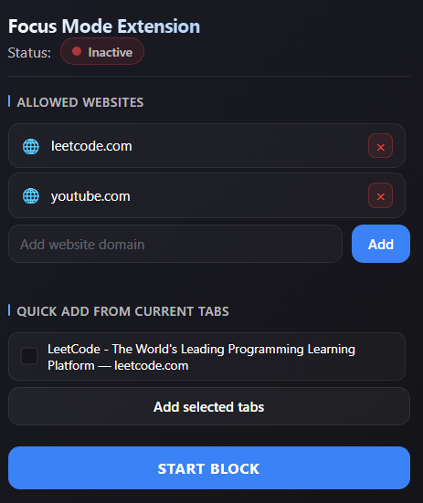
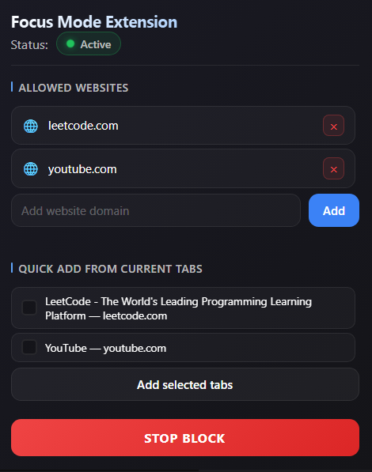

<div align="center">

# Focus Mode Extension

**A lightweight Chrome/Brave extension to block distracting websites during focus sessions.**

[](#)
[](LICENSE)

</div>

---

## 📸 Screenshots

<div align="center">
<table>
<tr>
<td></td>
<td></td>
</tr>
</table>
</div>

---

## ✨ Features

| Feature | Description |
|---------|-------------|
| 🚫 **Website Blocking** | Block all sites except your whitelist |
| ⚡ **Quick Add** | Add domains from open tabs with one click |
| 🌐 **Domain-based** | Allows all subdomains (e.g., `leetcode.com` allows `discuss.leetcode.com`) |
| 🎨 **Blur Overlay** | Beautiful overlay on blocked sites instead of redirect |
| 🔴 **Visual Indicator** | Icon turns red when focus mode is active |

---

## 📦 Installation

1. Download or clone this repository
2. Open `chrome://extensions` or `brave://extensions`
3. Enable **Developer mode** (top right)
4. Click **Load unpacked** → Select the extension folder

---

## 🚀 Usage

1. Click the extension icon in toolbar
2. Add allowed websites manually or select from open tabs
3. Click **Start Block** to enable focus mode
4. All non-whitelisted sites will show a blur overlay

---

## 📁 Project Structure

```
├── manifest.json      # Extension configuration
├── background.js      # Service worker (icon updates)
├── content.js         # Overlay injection script
├── popup.html/js/css  # Extension popup UI
└── icons/             # Extension icons
```

---

## ⚡ Performance

| Metric | Value |
|--------|-------|
| Memory | ~1-2 MB per blocked tab |
| CPU | Near zero (event-driven) |
| Network | None |

---

<div align="center">

**Stay focused. Get things done.** 🚀

</div>
